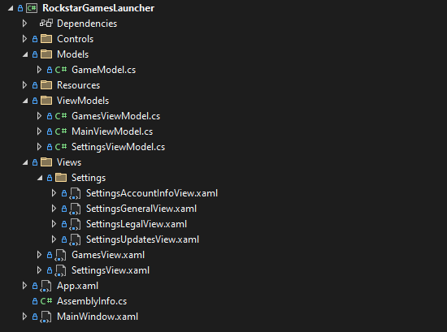
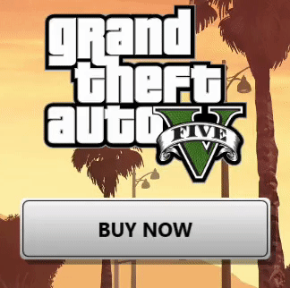
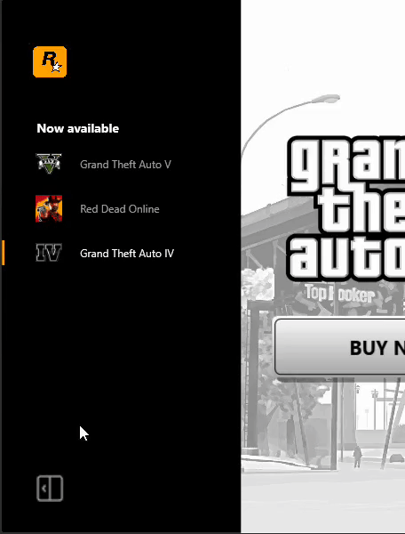
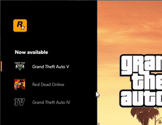
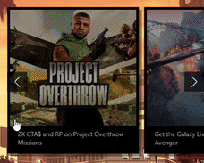
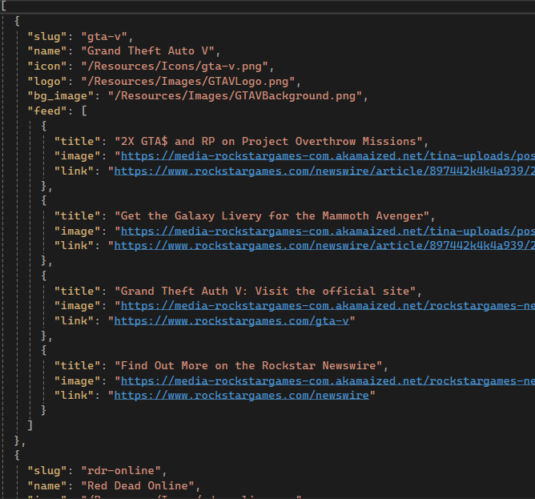
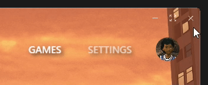

https://github.com/rohanharikr/RockstarGamesLauncher/assets/12775813/70d57f4a-8853-48ce-a6dc-18a634379174

# Rockstar Games Launcher

> [!IMPORTANT]
> This project is strictly intended for educational purposes and is not affiliated with Rockstar Games.  
> Please refer to the [Legal](#Legal) section for more information.

## Screenshots

#### Games

#### Settings

## Features
|     Name               |    Demo                                   |
| -----------------------|-------------------------------------------|
| MVVM                   |                     |
| Animated buttons       |            |
| Collapsible sidebar    |       |
| Custom navigation      |         |
| Animated carousel      |         |
| JSON file API          |              |
| Custom titlebar        |           |

## Legal

**Educational Purposes**: This project is strictly intended for educational purposes only. It serves as a sample real-world application showcasing the use of the MVVM pattern, animations, and other concepts.

**Disclaimer**: This project is an independent creation and is not affiliated with, endorsed, or sponsored by Rockstar Games, or any of its subsidiaries or affiliates.

**Ownership**: All trademarks, service marks, trade names, trade dress, product names, and logos appearing in this project are the property of Rockstar Games.
